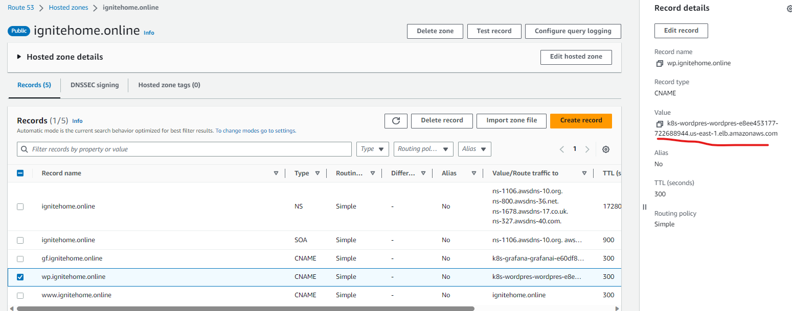

### Endereço dos ALB's

Podemos obter essa informação no Console mas também podemos executar o comando abaixo:

- `kubectl get ing -A`   - pega os endereços de ingress de todos os namespaces.

### Acessando o site

Nos arquivos de criação dos ALB's, nós configuramos os hosts como **wp.ignitehome.online** e **gf.ignitehome.online**.
Esse domínio foi comprado e criada uma hosted zone na AWS para que ao acessarmos os hosts/domínios, o DNS aponte para os endereços dos ALB's.

<figure markdown>
  { width="1000" }
  <figcaption>Adicionando o registro da rota no Route 53</figcaption>
</figure>
