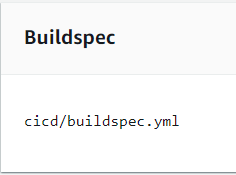
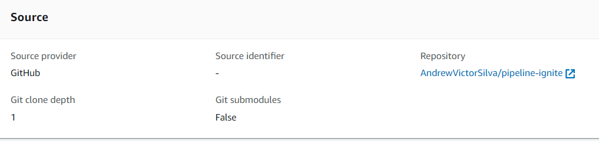

Primeiro passo é
<a href="https://docs.aws.amazon.com/codebuild/latest/userguide/getting-started.html" target="_blank">criar um projeto de build no console AWS</a>
e usar as especifição: <br />

### Variáveis de Ambiente

| Environment variables |
| --------------------- |
| AWS_ACCESS_KEY_ID     |
| AWS_SECRET_ACCESS_KEY |
| AWS_REGION            |
| PROFILE_NAME          |

### Buildspec
!!! note ""

    Muito importante passar o caminho correto do arquivo 👇🏻!
  
`~/buildspec.yaml`

#### Exameplo

``` yaml title="buildspec.yaml"
version: 0.2

phases:
  install:
    runtime-versions:
      python: 3.x

  pre_build:
    commands:
      - sudo yum -y install python3-pip
      - sudo pip3 install ansible
      - sudo pip3 install jmespath

      - curl -fsSL -o get_helm.sh https://raw.githubusercontent.com/helm/helm/main/scripts/get-helm-3
      - chmod 700 get_helm.sh
      - ./get_helm.sh

      - cd cicd
      - chmod +x install-terraform.sh apply-terraform.sh configure-named-profile.sh install-kubectl.sh
      - ./install-terraform.sh
      - ./configure-named-profile.sh
      - ./install-kubectl.sh

  build:
    commands:
      - ./apply-terraform.sh
      - cd ..
      - aws eks --region us-east-1 update-kubeconfig --name demo
      - pwd
      - cd config

      - ansible-playbook ./1-wordpress.yaml
      - ansible-playbook ./3-prometheus.yaml
      - ansible-playbook ./4-grafana.yaml

```

<!-- <figure markdown>
  { width="200"}
  <figcaption>Adicionando o registro da rota no Route 53</figcaption>
</figure> -->

### CodeBuild Source

Indicar o repositório que será a fonte do código que será utilizado.

<figure markdown>
  { width="700" }
  <figcaption></figcaption>
</figure>
